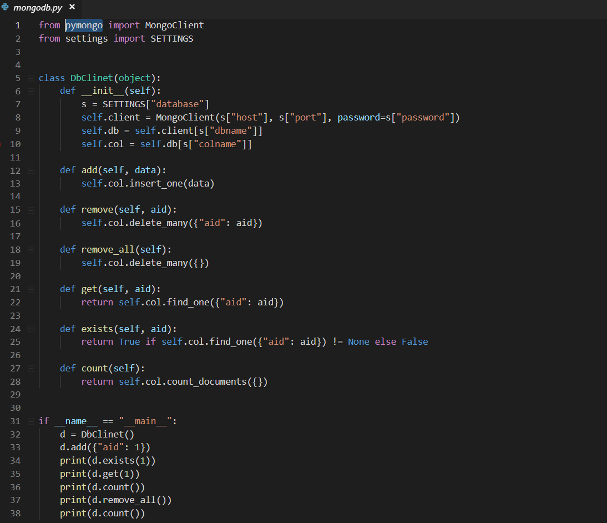
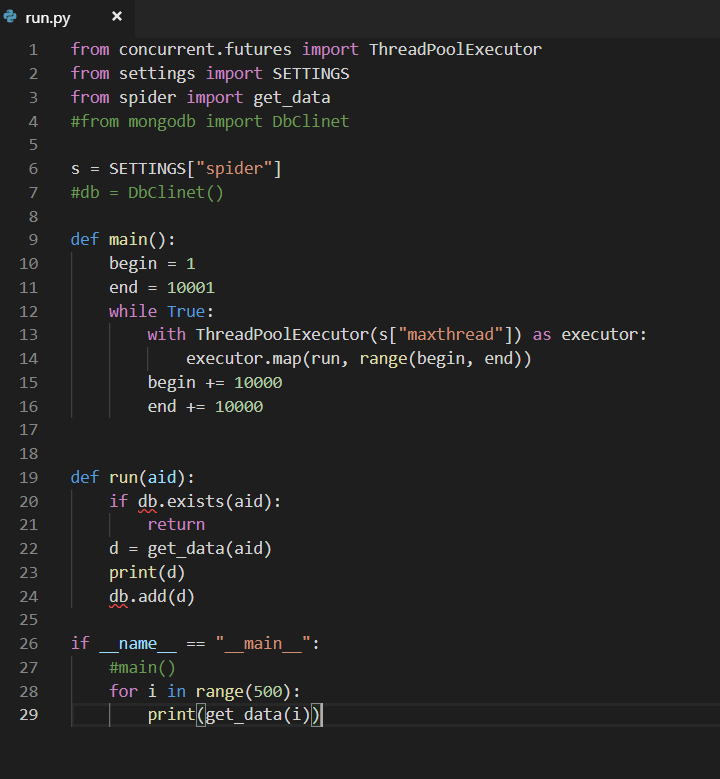
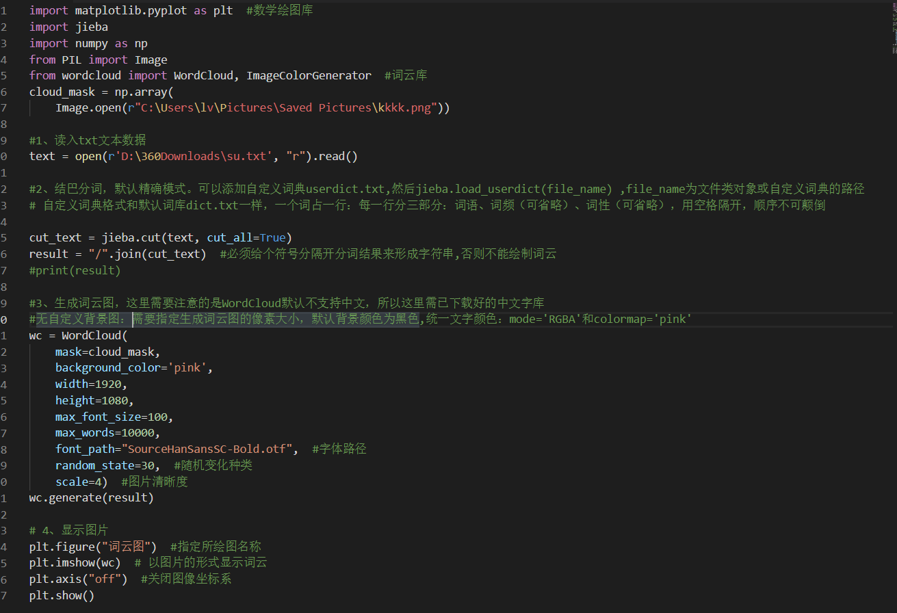

# **Spider.py**

## 作用爬取网页信息简单分类到data中去
```
import requests
import time
import html
import re
from lxml import etree
from random import choice
from useragent import USERAGNET
from settings import SETTINGS
```
## 引入库：
- Requests：   引入该库得以使用requests.get（）函数向
是用python语言基于urllib编写的，采用的是Apache2 Licensed开源协议的HTTP库，Requests它会比urllib更加方便，可以节约我们大量的工作。
- time：      time.perf_counter()；  time.sleep()；
- html:      html.unescape();
- re:      re.findall();
- from lxml import etree :    etree.html可以解析html文件 生成tree，从而调用
tree.xpath() #对html进行分析，获取抓取信息
- from random import choice :  choice(USERAGNET)  #从序列中随机取出一个元素
- from useragent import USERAGNET :调用先前编写的useragent文件（存储浏览器的用户代理），在此文件中作为USERAGENT出现，作为requests,get的参数useragent参数出现。
- from settings import SETTINGS:：调用先前编写的settings文件，在此文件中作为SETTINGS出现，调用已经设置好的常亮。

```
def get_data(aid):
    b = time.perf_counter()
    data = {}
    while True:
        time.sleep(s["interval"])

        json_raw = get_json(aid)
        html_raw = get_html(aid)

        if json_raw != None and html_raw != None:
            if json_raw["code"] != 0:
                data["aid"] = aid
                data["status"] = 1
            else:
                data = json_raw["data"]
                if data["view"] == "--":
                    data["status"] = 2
                else:
                    tree = etree.HTML(html_raw)
                    data["title"] = "_".join(
                        tree.xpath("/html/head/meta[8]")[0].xpath("@content")
                        [0].split("_")[0:-1])
                    data["desc"] = html.unescape(
                        tree.xpath("/html/head/meta[6]")[0].xpath("@content")
                        [0])
                    data["tname"] = tree.xpath(
                        '//*[@id="viewbox_report"]/div[1]/span[1]/a[2]/text()'
                    )[0] if tree.xpath(
                        '//*[@id="viewbox_report"]/div[1]/span[1]/a[2]/text()'
                    ) else ""
                    data["bname"] = tree.xpath(
                        '//*[@id="viewbox_report"]/div[1]/span[1]/a[1]/text()'
                    )[0] if tree.xpath(
                        '//*[@id="viewbox_report"]/div[1]/span[1]/a[1]/text()'
                    ) else ""
                    data["ctime"] = int(
                        re.findall(r'"pubdate":(\d+),', html_raw)[0])
                    data["status"] = 0
            return data
        e = time.perf_counter()

        if e - b > s["timeout"]:
            data["aid"] = aid
            data["status"] = -1
            return data
```

- 用变量a和e分别接受两个time.perf_counter()用来计算程序使用时间
time.perf_counter()：
返回性能计数器的值（以分秒为单位），即具有最高可用分辨率的时钟，以测量短持续时间。它包括在睡眠期间和系统范围内流逝的时间。返回值的参考点未定义，因此只有连续调用结果之间的差异有效。
- time sleep() 函数推迟调用线程的运行，可通过参数secs指秒数，表示进程挂起的时间。
- re.findall():每一次在匹配规则前面加了一个r，表示不转义，使用原生字符串，没用原始字符串，也没出现什么问题。那是因为ASCII 里没有对应的特殊字符，所以正则表达式编译器能够知道你指的是一个十进制数字。

```
def get_json(aid):
    retry = s["maxretry"]

    headers = {
        "Accept": "*/*",
        "Origin": "https://www.bilibili.com",
        "Referer": "https://www.bilibili.com/video/av%s/" % aid,
        "User-Agent": choice(USERAGNET)
    }

    while retry > 0:
        #https://api.bilibili.com/x/web-interface/view?aid=
        try:
            proxy = get_proxy()
            r = requests.get(
                "https://api.bilibili.com/x/web-interface/archive/stat?aid=%s"
                % aid,
                headers=headers,
                proxies={
                    "http": "http://{}".format(proxy),
                    "https": "http://{}".format(proxy)
                },
                timeout=3)
            #print(r)
            if r.status_code in [200, 301, 302, 303, 307]:
                return r.json()
        except Exception:
            retry -= 1

    delete_proxy(proxy)
    return None
```
- 301、302、303、307状态码
都表示重定向即访问成功。
301永久重定向
302临时重定向，HTTP1.0的状态码，HTTP1.1也有保留。
如果client向server发送post请求。
server返回URL和302。
如果用户确认，client发送post请求。（但实际情况是，很多浏览器都不问问用户，直接变为get发送get请求）
303临时重定向，HTTP1.1的状态码//
发送Post请求，收到303，直接重定向为get，发送get请求，不需要向用户确认
307临时重定向，HTTP1.1的状态码
客户端发送post请求返回307时，浏览器询问用户是否再次post

```
def get_html(aid):
    retry = s["maxretry"]

    headers = {
        "Accept":
        "text/html,application/xhtml+xml,application/xml;q=0.9,image/webp,image/apng,*/*;q=0.8,application/signed-exchange;v=b3",
        "Host": "www.bilibili.com",
        "Referer": "https://www.bilibili.com/",
        "User-Agent": choice(USERAGNET)
    }

    while retry > 0:
        try:
            proxy = get_proxy()
            r = requests.get("https://www.bilibili.com/video/av%s/" % aid,
                             headers=headers,
                             proxies={
                                 "http": "http://{}".format(proxy),
                                 "https": "http://{}".format(proxy)
                             },
                             timeout=3)
            #print(r)
            if r.status_code in [200, 301, 302, 303, 307]:
                return r.text
        except Exception:
            retry -= 1

    delete_proxy(proxy)
    return None
```


# **附录**

- equests.request(method,url,**kwargs)中的参数问题：
- method：请求方式，对应get/put/post等7种
- url：拟获取页面的url链接
- **kwargs：控制访问参数，共13个
- **kwargs：控制访问的参数，均为可选项:
- params:字典或字节序列，作为参数增加到url中
例：kv={'key1':'value','key2':'value2'}
    r=requests.request('GET','http://python123.io/ws',params=kv)
    print(r.url)
http://python.io/ws?key1=value1&key2=value2
- data:字典，字节序列或文件对象，作为Request的内容
- json:JSON格式的数据，作为Request的内容
- headers：字典，HTTP定制头（模拟浏览器进行访问）
- cokies：字典或CpplieJar,Request中的cookie
- auth:元祖，支持HTTP认证功能
- files：字典类型，传输文件
- timeout:设定超时时间，秒为单位
- proxies:字典类型，设定访问代理服务器，可以增加登陆认证
- allow_redirects:True//False，默认为True，重定向开关
- stream:True/False,默认为True,获取内容立即下载开关
- verify:True/False,默认为True，认证SSL证书开关
- cert：本地SSL证书路径

# **数据库连接部分**

## 代码截图


## 解释
首先引入python操作mongo数据库的工具库pymongo库，对数据库连接做准备，settings则包括了数据库的主机，密码，端口号等，会在settins的详解中介绍。
定义一个类 DbClinet为连接类，init方法开始进行赋值，然后定义增加，删除，全删，查询，查重，计数功能。主函数中调用连接，做连接测试。

# **运行部分**

## 代码截图


## 解释
标准库为我们提供了concurrent.futures模块，它提供了ThreadPoolExecutor和ProcessPoolExecutor两个类ThreadPoolExecutor和ProcessPoolExecutor继承了Executor，分别被用来创建线程池和进程池的代码。实现了对threading和multiprocessing的更高级的抽象，对编写线程池/进程池提供了直接的支持。因为爬虫需要多线程加快速度所以需要引用该模块。
引入设置模块，爬虫模块和数据库模块。
在main方法中设置多线程的参数，一万一组，进行爬取，将文件存入数据库。

# 数据处理
本次实验因为数据是十万量级的，对所有数据进行处理比较困难，所以我们使用 matplotlib和wordcloud，jieba等库对经过处理的数据（仅剩时间，标题，简介）进行词云分析，因为电脑性能问题，所以仅使用了2000条数据的标题进行分析。效果图如下


通过这张图，不难发现b站的热门视频集中于翻唱，MMD,MAD，中字翻译，魔法少女，生化危机，排行榜，技术类，背景音乐类主题。其中MMD,MAD,翻唱是出现频率最大的，说明B站建站初期是以二次元视频网站出名的，与实际相符。
词云代码截图如下


# **Useragent.py**
```
"Mozilla/5.0 (Windows NT 10.0; Win64; x64) AppleWebKit/537.36 (KHTML, like Gecko)  Chrome/70.0.3538.77 Safari/537.36"
```

请求头的库 ，一共是4900多条

# **Sitting.Py**
```
SETTINGS = {
    "database": {
        "type": "mongodb", # 数据库类型
        "host": "127.0.0.1",#主机地址
        "port": 27017,   #接口
        "password": "", #密码
        "dbname": "bilibili",#数据库名称
        "colname": "videos"
    },
    "spider": {
        "timeout": 10,  #超时
        "maxretry": 3,  #尝试次数
        "interval": 0.5,  #每次时间间隔
        "maxthread": 32  # 多线程数
    }
}
```

# **GitHub学习**

## 创建远程仓库
我在github账户上创建了一个git_test的仓库。
创建完成仓库之后，github会显示一些git的基本操作
```
git init
git add README.md
git commit -m "first commit"
git remote add origin git@github.com:TonySudo/git_test.git
git push -u origin master

... or push an existing repository from the command line

git remote add origin git@github.com:TonySudo/git_test.git
git push -u origin master
```

## 克隆远程仓库到本地
仓库建好了，如何上传文件呢？我知道的有两种方法：
- 将github上的仓库clone到本地，添加文件之后再push。
- 在本地创建仓库，连接到远程的仓库,然后再push文件。
```
$ git clone git@github.com:TonySudo/git_test.git
# 克隆某个分支, 使用-b选项，进行分支的选择，branch是远端仓库分支的名字。
 $ git clone -b branch https://github.com/TonySudo/git_test.git
# 创建文件
 $ touch master
$ git add master  # 增加到缓存之中
$ git commit -m "init push" # 增加commit的备注内容
# 上传到github
$ git push
# 连接远程仓库
$ git remote add origin git@github.com:TonySudo/git_test.git
# origin 是定义的远程主机的名字， origin 是远程仓库的网址
```
如果输入$ git remote add origin git@github.com:djqiang（github帐号名）/gitdemo（项目名）.git
提示出错信息：fatal: remote origin already exists.
解决办法如下：
- 先输入$ git remote rm origin
- 再输入$ git remote add origin git@github.com:djqiang/gitdemo.git 就不会报错了！
- 如果输入$ git remote rm origin 还是报错的话，error: Could not remove config section 'remote.origin'. 我们需要修改gitconfig文件的内容
- 找到你的github的安装路径，我的是C:\Users\ASUS\AppData\Local\GitHub\PortableGit_ca477551eeb4aea0e4ae9fcd3358bd96720bb5c8\etc
- 找到一个名为gitconfig的文件，打开它把里面的[remote "origin"]那一行删掉就好了！


[参考博客](https://blog.csdn.net/dengjianqiang2011/article/details/9260435)
```

# 查看远程仓库的名字：
$ git remote -v
如果出现错误。
fatal: The current branch master has no upstream branch.
To push the current branch and set the remote as upstream, use git push --set-upstream origin master
$ git push --set-upstream origin master
```

如果出现hint冲突问题
如下：

```
hint_ not have locally. This is usually caused by another repository pushing
hint_ to the same ref. You may want to first integrate the remote changes
hint_ (e.g., 'git pull ...') before pushing again.
hint_ See the 'Note about fast-forwards' in 'git push --help' for details
```

```
git push --set-upstream origin master -f
强制push
```

## 提取服务器上的更新
```
# 从服务器上下载更新，这只是下载下来，没有对源码进行更改。
#  默认取回所有的更新。
$ git fetch origin

# 取回某一个分支的更新,branch1是分支名,可以是master或者其他的。
$ git fetch origin branch1

# 将fetch下来的跟新和本地的分支进行合并。merge之后，本地的源码才会改变。
$ git merge

# git pull相当于执行了git fetch和git merge
# 将远程的branch1分支的内容下载到本地的master分支。
# 也可以将branch1更改为其他的，例如master.
$ git pull origin branch1:master
```

## 文件上传
```
# 将本地的分支branch上的更新上传到远端的master分支。
$ git push origin branch:master
Counting objects: 3, done.
Writing objects: 100% (3/3), 200 bytes | 0 bytes/s, done.
Total 3 (delta 0), reused 0 (delta 0)
To git@github.com:TonySudo/git_test.git
 * [new branch]      master -> master
有时候会出错，说明本地上的文件跟服务器上的不同步
$ git push origin branch:master
To git@github.com:TonySudo/git_test.git
 ! [rejected]        master -> master (non-fast-forward)
error: failed to push some refs to 'git@github.com:TonySudo/git_test.git'
hint: Updates were rejected because the tip of your current branch is behi
hint: its remote counterpart. Integrate the remote changes (e.g.
hint: 'git pull ...') before pushing again.
hint: See the 'Note about fast-forwards' in 'git push --help' for details.

解决方法，先将服务器上的更新先下载到本地，这样就和服务器上的同步了，再进行提交即可。

将本地的branch分支的内容传送大远端仓库的branch分支
$ git push origin branch:branch
Counting objects: 2, done.
Delta compression using up to 4 threads.
Compressing objects: 100% (2/2), done.
Writing objects: 100% (2/2), 255 bytes | 0 bytes/s, done.
Total 2 (delta 0), reused 0 (delta 0)
To git@github.com:TonySudo/git_test.git
 * [new branch]      branch -> branch
```

## 分支
创建一个名为branch1的分支
``git branch branch1``
切换到分支branch1
``git checkout branch1``
将本地master分支的文件上传到远端仓库的名为branch1的分支上。 如果远端这个分支不存在，就会创建这个分支。
``git push origin master:branch1``

## 其他使用
//配置user.name
``git config --global user.name "your user name"``

//配置user.email
``git config --global user.email "your user email"``

``git status``
仅仅是 列出了(修改过的、新创建的、已经暂存但未提交的)文件，如果要查看具体修改了什么地方，可以用git diff 命令。稍后我们会详细介绍 git diff，不过现在，它已经能回答我们的两个问题了：当前做的哪些更新还没有暂存？有哪些更新已经暂存起来准备好了下次提交？git diff 会使用文件补丁的格式显示具体添加和删除的行。

## 秘钥生成
[参考](https://blog.csdn.net/mrsyf/article/details/79778632)

## GitHub国内网速慢问题
准备工作做完之后，打开的hosts文件中添加如下格式，IP修改为自己查询到的IP： 192.30.xx.xx github.com 151.101.xx.xx github.global.ssl.fastly.net
这是我测试之后最好用的。
除此之外还可以参考DNS污染问题的解决办法。
