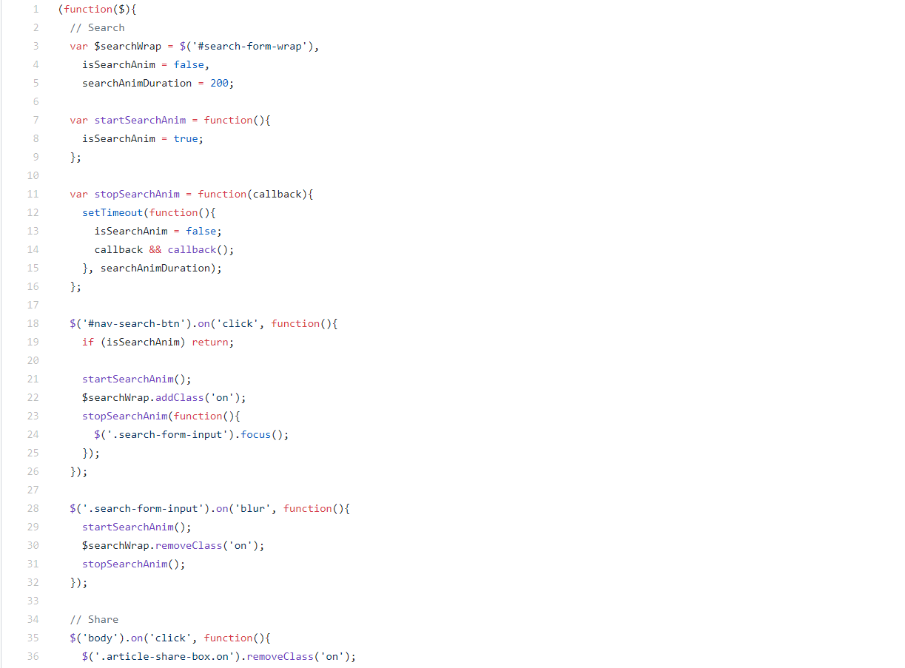

# **实验名称**
## 在Linux环境下对GitHub网站个人博客的搭建

# **实验目的（要求）**
- 学会在Linux环境下配置安装hexo及GitHub
- 学会使用hexo进行搭建网页
- 掌握对网站的更新
- 充分调试并使其能在Linux环境下运行

# **实验环境**
## Linux操作系统

# **有关工具**
## Hexo + GitHub

# **实验内容**
## 设计一个在GitHub上可以发布和阅读文章的个人博客网站，使用Hexo进行搭建，使其可以发布文章。并在Linux环境下实现运行

# **设计解析**
- 安装git
```
sudo apt-get install git
```
- 安装node.js
```
sudo apt-get install nodejs
sudo apt-get install npm
node -v
npm -v
```
- 安装Hexo
```
npm install -g hexo-cli
```
- GitHub创建个人仓库
- 生成SSH添加到GitHub
- 将hexo部署到GitHub

# **效果展示**


# **代码截图**



# **实验心得**
经过这次实验，让我对Linux环境下的各种操作更加熟练，并且掌握各种语法，收获颇多